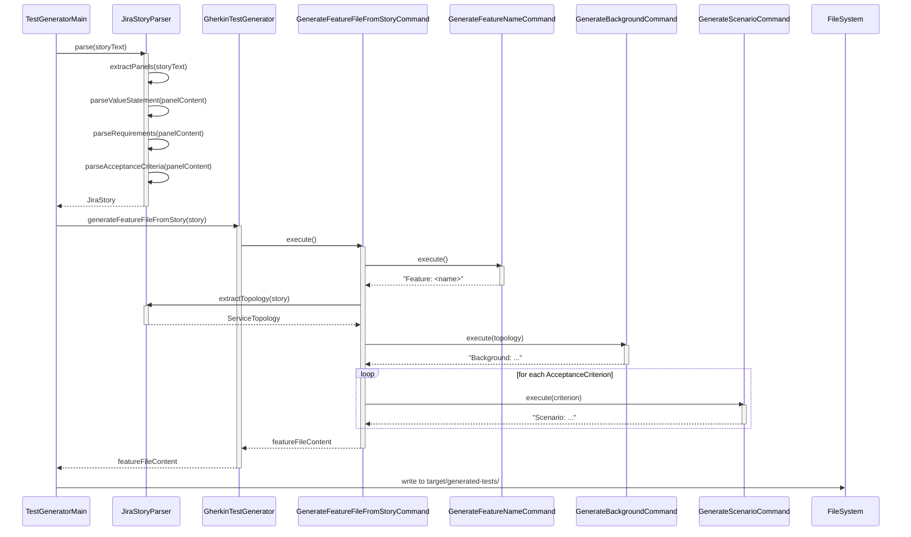
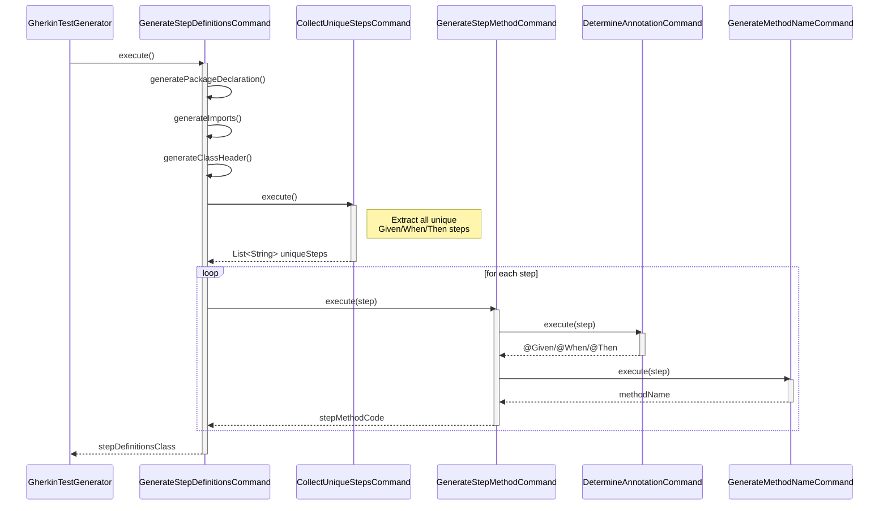
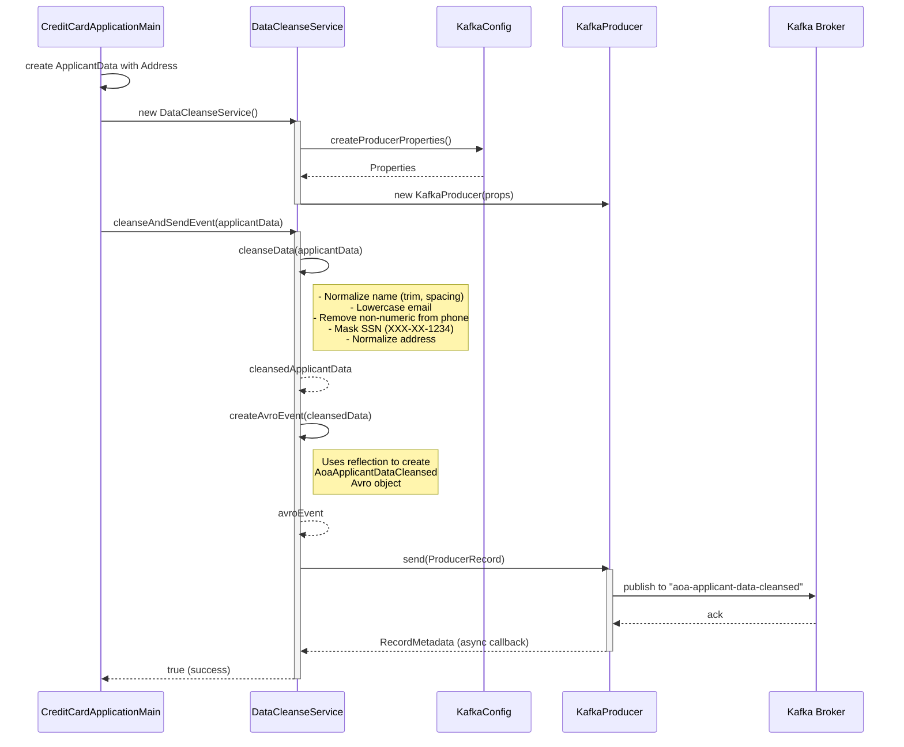
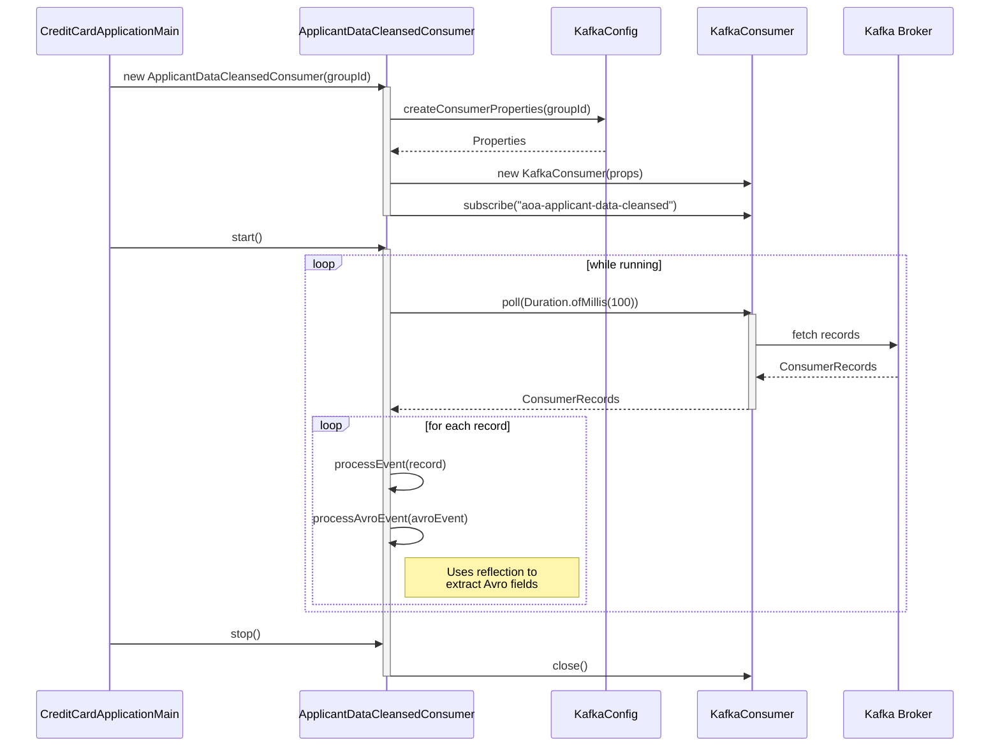
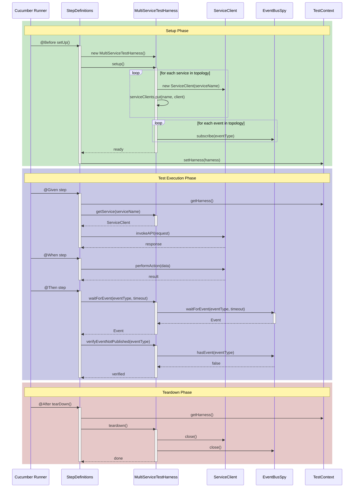
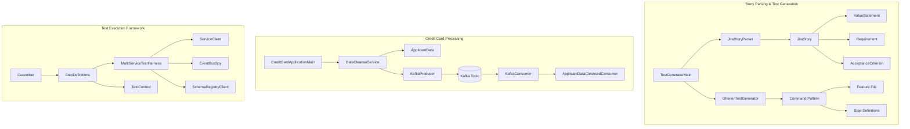

# Codebase Sequence Diagrams

This document contains sequence diagrams illustrating the main flows in the "From Requirements to Code" system.

## Overview

The codebase consists of three main subsystems:
1. **Story Parsing & Test Generation** - Parses Jira stories and generates Gherkin test files
2. **Credit Card Processing (Kafka)** - An event-driven system for processing credit card applications
3. **Test Execution Framework** - A test harness for running acceptance tests

---

## Flow 1: Jira Story Parsing & Test Generation

This flow shows how a Jira story is parsed and transformed into a Gherkin feature file.

---

## Flow 2: Step Definitions Generation

This flow shows how step definition Java classes are generated from a parsed Jira story.

---

## Flow 3: Credit Card Data Cleansing & Kafka Event Publishing

This flow shows how applicant data is cleansed and published to Kafka.

---

## Flow 4: Credit Card Event Consumption

This flow shows how events are consumed from Kafka by the consumer service.

---

## Flow 5: Test Execution with Test Harness

This flow shows how acceptance tests are executed using the MultiServiceTestHarness.

---

## Component Relationships

---

## Key Files

| Component | File Path |
|-----------|-----------|
| TestGeneratorMain | `src/main/java/an/story/main/TestGeneratorMain.java` |
| JiraStoryParser | `src/main/java/an/story/parser/JiraStoryParser.java` |
| GherkinTestGenerator | `src/main/java/an/story/generator/GherkinTestGenerator.java` |
| DataCleanseService | `src/main/java/an/story/creditcard/service/DataCleanseService.java` |
| ApplicantDataCleansedConsumer | `src/main/java/an/story/creditcard/consumer/ApplicantDataCleansedConsumer.java` |
| MultiServiceTestHarness | `src/main/java/an/story/framework/MultiServiceTestHarness.java` |
| KafkaConfig | `src/main/java/an/story/creditcard/config/KafkaConfig.java` |
| Avro Schema | `src/main/resources/avro/aoaApplicantDataCleansed.avsc` |
